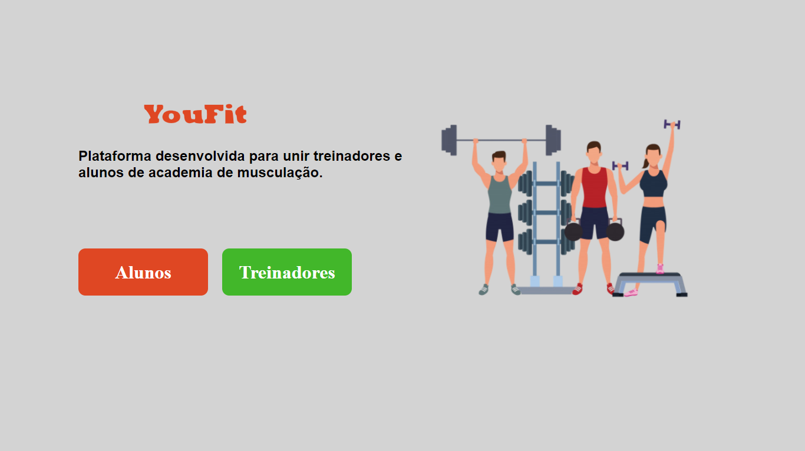

<!---Logo do Projeto -->

#<p align="center" >


</p>

<!--- Descrição do Projeto-->
<p align="center">Projeto desenvolvido para unir treinadores e alunos de academia de musculação.</p>

## Web Screenshot

<p align="center" >
 
</p>

## 🛠 Tecnologias

As seguintes ferramentas foram usadas na construção do projeto:

- [React](https://pt-br.reactjs.org/)
- [Node.js](https://nodejs.org/en/)
- [Express](https://expressjs.com/)

## 👷 Como rodar

```bash
#Clone o Repositório
$ git clone https://github.com/K4ME/Youfit.git
```

<br/>

## 📦 Rodar API

```sh
# Vá para a pasta do servidor
$ cd Youfit/Backend

# Instale as depedencias
$ yarn install

# Rode a aplicação
$ yarn dev
```

### Acesse a API: http://localhost:3333/

<br/>

## 💻 Rode o Project Web

```sh
# Vá para a pasta web
$ cd Youfit/Frontend

# Instale as depedencias
$ yarn install

# Rode a aplicação
$ yarn start
```

### Acesse: http://localhost:3000/ para ver o resultado.

<br/>
<br/>

Desenvolvido por [Guilherme Macrini](https://github.com/K4ME) 🚀. <br/>
Esse projeto esta sobre [MIT license](./LICENSE).
